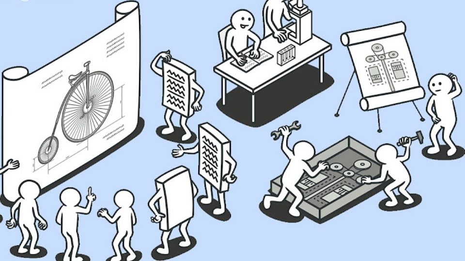

## The Secret Recipes Behind Efficient Code

Have you ever found yourself performing a task so often that it becomes automatic, where you can complete the routine without even thinking? After enough repetition, you inevitably discover the most efficient way to get the job done. This is similar to how an experienced chef can effortlessly prepare a dish they’ve made countless times, following a recipe that guarantees a perfect result every time. In software development, design patterns function in much the same way. They are proven, reusable solutions to common problems developers encounter, offering a standardized approach to solving recurring challenges. Just as a recipe guides a chef without handing them a fully prepared meal, design patterns don’t provide complete code but offer frameworks that developers can build upon. With reusability, efficiency, and flexibility, design patterns help developers avoid starting from scratch, enabling them to solve problems quickly and effectively.

## Using Design Patterns

There are various design patterns, each helping to solve specific and common problems that software developers typically face. A common pattern is the Singleton Pattern, which ensures that a class has only one instance and provides a global access point to it. I’ve implemented this pattern in my projects when managing authentication, ensuring that only one instance of the authentication manager exists throughout the application. This helps maintain consistency and prevents issues with conflicting configurations. Another example is the Decorator Pattern, which allows developers to dynamically add functionality to an object without affecting the behavior of other objects within the same class. This is done through inheritance, extending the class's behavior at compile-time, so all instances of that class inherit the extended behavior. I’ve found this useful in my projects when adding additional features like logging to functions, allowing me to modify or extend their behavior without altering the core logic. It provides a flexible way to add functionality to an object on a case-by-case basis, without changing the object’s original structure.
