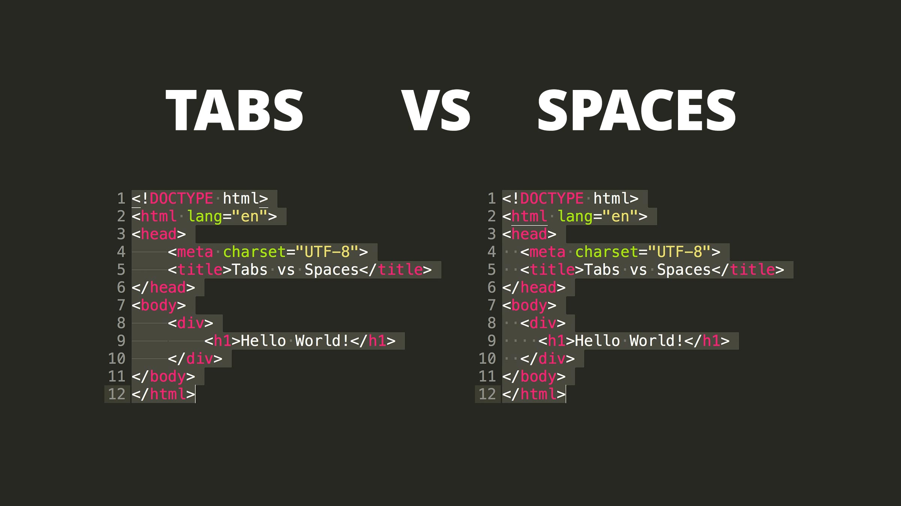

## Introduction
Coding standards are guidelines that ensure code is readable, maintainable, efficient, reliable, and reusable. While some of these standards may feel tedious, such as needing to add a space after commas in function arguments, they are not essential for a program to run. However, they play a key role in producing high-quality code, which makes it easier for collaborators to understand and contribute. For example, naming conventions improve clarity, reducing confusion for anyone working on the program. When all developers follow the same structural guidelines, collaboration becomes smoother, and sharing code is more straightforward. A shared understanding of these standards helps teams work together more effectively and allows developers to focus on building functional, reliable programs without without being hindered by inconsistencies or confusion.

## From Errors to Insights
The ESLint extension for Visual Studio Code helps enforce coding standards. During the ICS 314 course, the extension frequently generated errors that interrupted my workflow while focusing on program functionality. Over time, the value of the extension became clear, as it eliminated the need to manually review and correct code to meet these standards. The importance of coding standards became even more evident when collaborating with other programmers on the final project. It was crucial to consider how others would interpret the code, particularly if it wasn’t formatted consistently. A set coding standard fostered mutual understanding and reduced confusion within the team. Ultimately, the extension proved to be an essential tool for maintaining consistent coding practices.

## Conclusion
In conclusion, coding standards may seem frustrating, especially for those just starting to learn how to code. However, it’s crucial to understand their value early on, as they help maintain consistent coding practices. In the long run, programming is a collaborative task where code needs to be shared and worked on together. Tools that enforce these standards make it easier to fix code, ensuring it is functional, reliable, and maintainable. Embracing coding standards will lead to more efficient development and smoother collaboration.

## Use of AI
Throughout this essay, AI tools such as Grammarly and ChatGPT were used to enhance the grammar, punctuation, and clarity of the writing. While the ideas presented are my own, AI helped to refine the overall flow and tone.