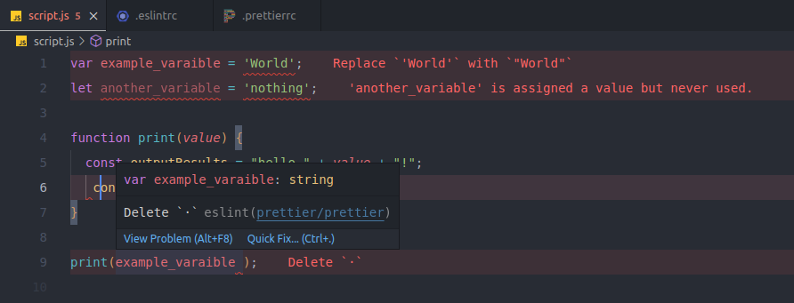
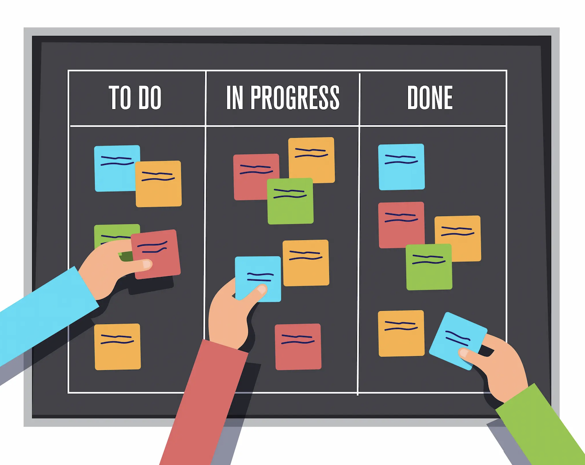

## Introduction
In recent years, artificial intelligence (AI) has significantly transformed the experiences of both students and educators. AI has become a widely used tool in the academic sphere, helping with studying, completing assignments, and even creating teaching guides. For software engineers, especially students like myself studying computer science, AI has been a useful resource. It can detect syntax errors, identify issues, revise function functionality, and even generate entire pieces of code. In my experience, various AI tools have been helpful for tasks like revising grammar. However, in software engineering, the only AI tool I’ve used is ChatGPT, designed to receive instructions and provide responses based on user input.

## Standards for Effective Collaboration
For programmers, the frustration of coding standards is understandable. These standards are a set of “rules” that programmers are expected to follow when writing code. These rules ensure that each programmer’s work is organized and easy to follow. Some of these rules include the “correct” amount of spacing for indentation, line length, brace placement, naming conventions, proper documentation, and more. While these rules can be tedious to follow, especially when working on a project, they ultimately make collaboration easier and reduce confusion. In this course, we used the ESLint tool, which analyzes code and flags “errors” when it doesn’t follow specific standards. As shown in the image above, programmers are required to fix these errors when using ESLint. At first, I didn’t understand why my instructor insisted on following these rules, but over time, I began to see their value. The importance of coding standards extends beyond web development. In any situation where you need to share your work, it’s crucial that others can easily understand what you’ve done. This becomes even more important when working in a group, especially if everyone has their own approach. While following strict rules can be frustrating at first, it ultimately helps avoid confusion and makes it easier to get things done.

## Flexible Teams, Successful Projects
When working on large projects, it can be overwhelming to prioritize what needs to be done. In this course, we learned about Agile Project Management to manage the feeling of being overwhelmed. It’s an iterative approach that prioritizes continuous improvement at each stage of a project, recognizing that projects are constantly changing. This method works well because it’s flexible and adaptable. For our final projects, we collaborated with classmates, and the project requirements were vague as we didn’t have specific instructions to follow. Each group had their ideas, and we had to figure out how to proceed independently. We used a specific style of Agile Project Management called Issue-Driven Project Management. In this approach, we identified tasks to complete by a certain milestone date and moved these tasks from the “to-do” list to the “in-progress” list, and finally to the “done” list. This approach was extremely helpful because it allowed us to break down tasks and distribute them more effectively. We could collaborate efficiently while working on our tasks, leading to less frustration and fewer conflicting ideas. The flexibility of Agile Project Management makes it valuable beyond software engineering. In any environment, breaking a project into smaller pieces and staying adaptable will be key to success. This ensures that progress will be made to meet deadlines, even when facing obstacles.

## Conclusion
Reflecting on the use of AI in this software engineering course, I realize that it significantly shaped my learning experience. It provided me with opportunities to effectively grasp the material my instructor aimed to teach and even enabled me to implement features in my final project that were not explicitly covered in the course. However, both myself and other students need to be mindful of how heavily we rely on these AI tools. Finding a balance between using AI to enhance learning and maintaining independent problem-solving skills is essential. For future courses, I would recommend that instructors actively remind students of their capabilities and encourage them to attempt solutions independently before turning to AI tools.

## Use of AI
Throughout this essay, AI tools such as Grammarly and ChatGPT were used to enhance the grammar, punctuation, and clarity of the writing. While the ideas presented are my own, AI helped to refine the overall flow and tone.