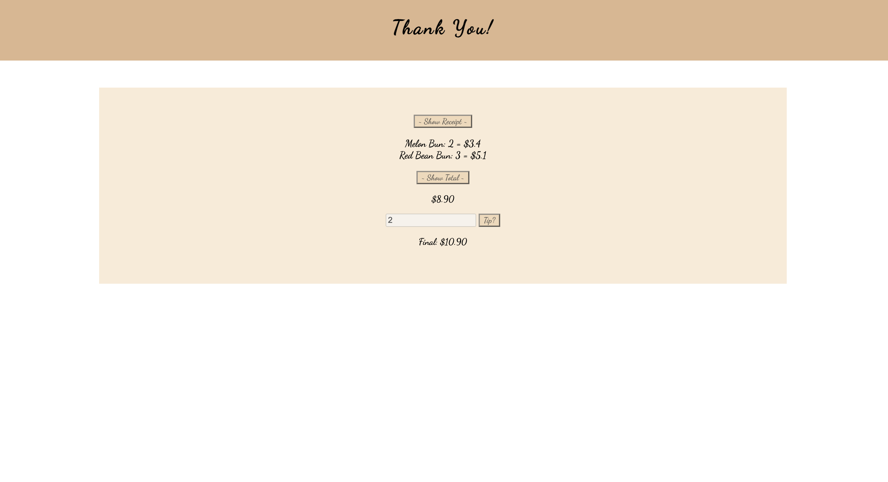

This bakery shop website was developed as part of a class project in Spring 2021. The objective of the project was to enhance my understanding of HTML and CSS while incorporating JavaScript. I used JavaScript specific commands such as selecting elements by their ID or tag, storing data in local storage, and transferring that data between pages. The website allowed users to select items and see their selections reflected on a subsequent webpage, simulating an online ordering process. While the design was simple, I applied what I learned about creating cohesive aesthetics, using fonts, colors, and images to achieve a unified and appealing look.

I was responsible for the entire project, handling both the coding and design. However, I did receive guidance from my instructor when I encountered challenges with passing information between pages. One of the main difficulties I faced was ensuring that the user’s order information and receipt were both accurate and visually appealing on the second page. With my instructor’s help, I was able to format the data correctly, ensuring the receipt displayed properly and included calculations for item totals.

This project focused on storing the costs of items users added to their orders and displaying them correctly. One of the key lessons I learned was the importance of understanding data types. Early on, my website displayed "NaN" (Not a Number) errors because I did not handle certain values properly. This project taught me the importance of how data is processed and displayed.

<a href="https://github.com/tiffanyduong1/bakeryshop"> To see my project, click here. </a>

