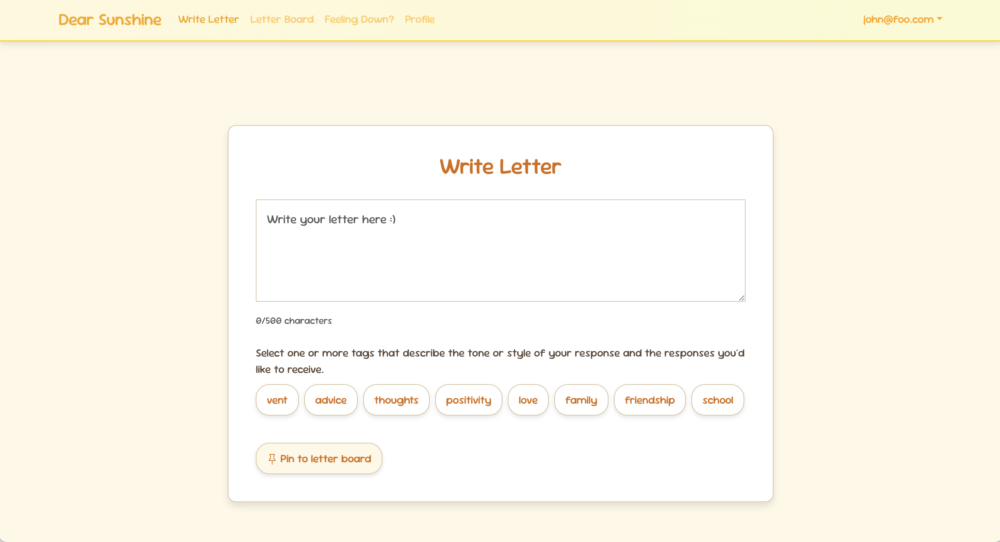
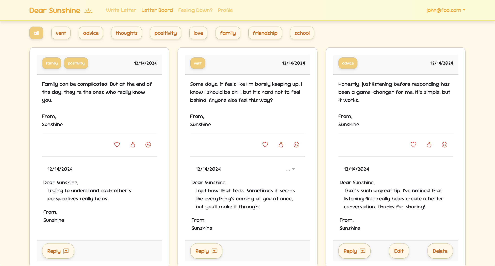

  
  

 
Dear Sunshine is a program where users can post letters to a “Letter Board” when they need encouragement or want to vent. The application allows others to respond to these letters, offering support and kindness. The goal is to create a friendly, uplifting environment that brightens someone’s day. Many people experience feelings of isolation or sadness and could benefit from positive, uplifting messages to brighten their day. While social media allows for sharing updates, it lacks a dedicated space where users can anonymously send and receive encouragement within a supportive community. Dear Sunshine addresses this gap by providing a platform where users can receive kind messages in response to what they’ve shared or vented about on the board.

In this project, I was responsible for developing the frameworks for the "Write Letter" and "Letter Board" pages. I implemented the functionality that allows users to type into a text box and post their entries, with all posts displayed on the "Letter Board" page. I had also integrated filter buttons on the "Letter Board" page, enabling users to view posts with specific tags. Additionally, I developed a reply feature, allowing users to respond to posts, and implemented the ability for users to delete their own posts and replies. I also created the foundational structure for the "Profile Page," where users can view only their own posts and replies. Through this project, I gained valuable experience in collaborating with others on a web development project, which was a first for me. While we faced challenges, particularly in agreeing on the visual design aspects, it was incredibly beneficial to gather input from my team members. For the features I worked on, I frequently consulted with my teammates whenever I encountered obstacles, which helped ensure successful implementation.

<a href="https://github.com/orgs/dear-sunshine/repositories"> To see my project organization, click here. </a>
