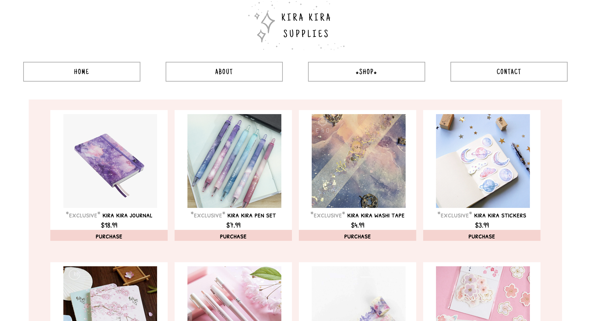

Kira Kira Supplies is a shopping website I developed as part of a class project in Fall 2019. The assignment allowed for creative freedom in designing a website and implementing a responsive interface for user interaction.

The website was built using HTML and CSS, the first programming languages I learned. As a beginner, I faced many challenges, particularly in the design aspect. To overcome these, I frequently sought advice from peers and instructors on how to enhance the simplicity of the user interface and create an engaging browsing experience.

Although I have since learned more advanced programming languages, this project grew my passion for web development. It inspired me to explore additional languages and take on more complex projects, growing my interest in this field even more.

Source: <a href="https://github.com/jogarces/ics-313-text-game"><i class="large github icon "></i>jogarces/ics-313-text-game</a>
