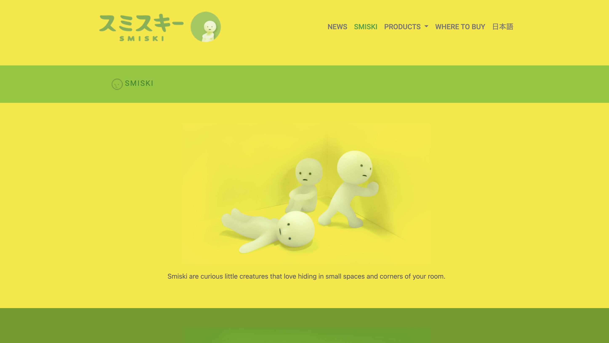

This Smiski webpage was created as part of a class project in Fall 2024, where the goal was to replicate an existing webpage using Bootstrap 5. This project significantly enhanced my skills, as each student selected a different website to recreate, and there were no straightforward answers on how to use Bootstrap 5 elements for the task. Although I had previously worked on projects using HTML and CSS, this experience taught me to navigate the limitations of CSS effectively. I learned to implement features such as a navbar, flexbox for arranging rows and columns, and icon usage.

The project focused on accurately mirroring the original design, and I found that the most challenging aspect was overriding certain design elements with CSS. I later discovered that some styles were not applying correctly because the link to my custom CSS file was placed above the Bootstrap 5 links in the header. Overall, this project, though simple, pushed me to problem-solve and develop a deeper understanding of web design.

<a href="https://github.com/tiffanyduong1/smiski"> To see my project, click here. </a>
